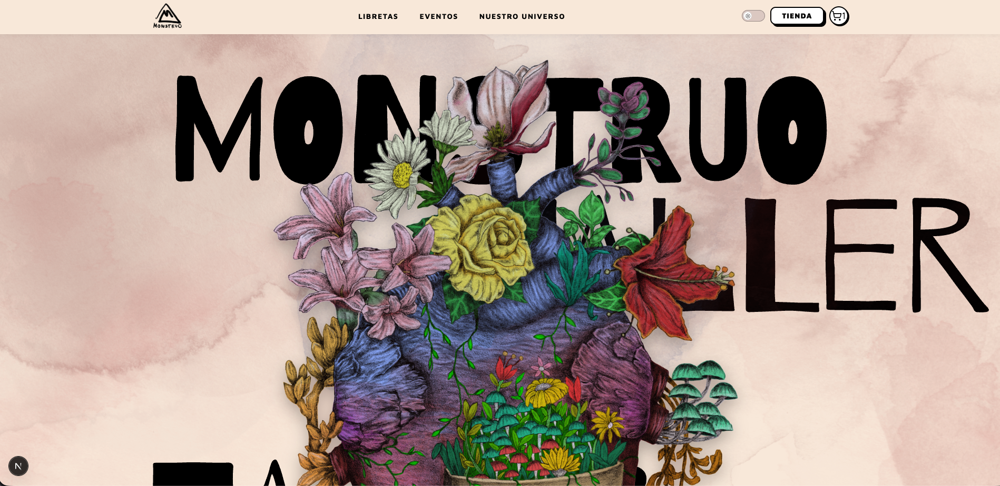
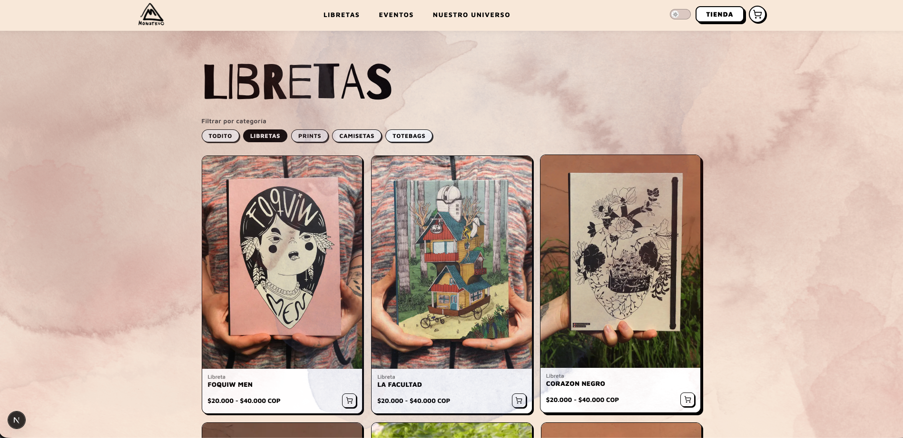
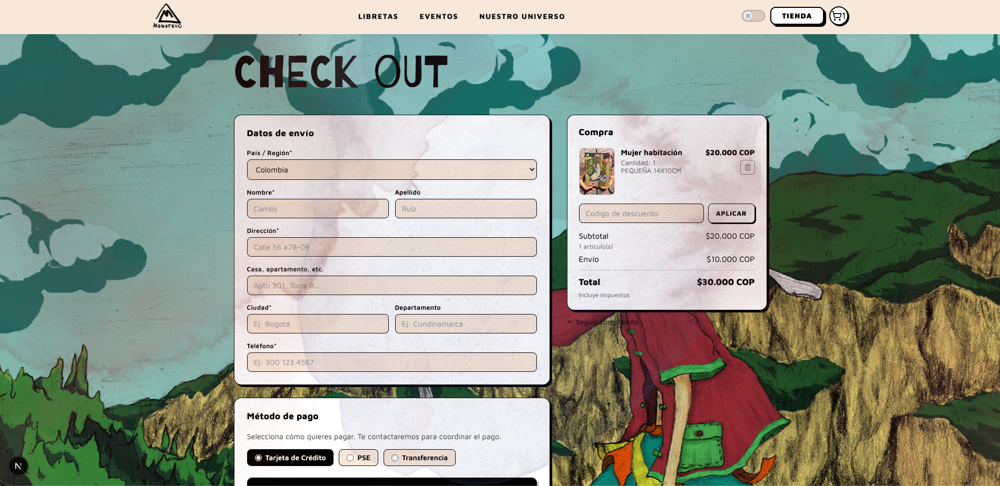
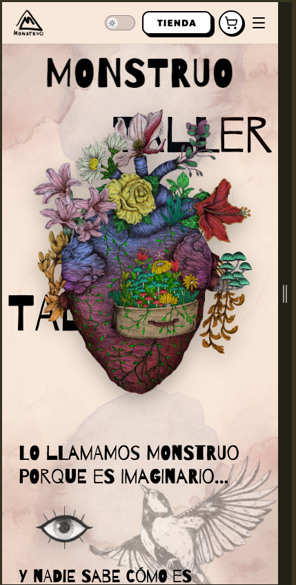

# 🦍 Monstruo Catalog

**Catálogo Visual Interactivo para PYMEs Colombianas y Artistas Independientes**

Una página "monstruo" moderna, rápida y 100% visual creada con React para que pequeñas empresas y artistas puedan mostrar sus productos de forma impactante sin necesidad de programadores.

---

## ✨ ¿Qué es Monstruo?

Monstruo es un **catálogo digital mobile-first** pensado especialmente para:
- Pequeñas PYMEs colombianas
- Artistas independientes
- Emprendedores que necesitan algo **bonito, rápido y profesional**

En lugar de una tienda aburrida, creé una experiencia visual potente donde el producto brilla por sí solo.

---

## 🚀 Características Principales

- ✅ Carga dinámica de productos desde JSON (fácil de actualizar)
- ✅ Filtros por categoría, precio y búsqueda en tiempo real
- ✅ Simulación de carrito de compras
- ✅ Animaciones suaves y efectos hover premium
- ✅ Diseño totalmente responsivo (quedó espectacular en móvil)
- ✅ Grid moderno + tipografía elegante (pensado para artistas)
- ✅ Optimizado para velocidad y SEO básico
- ✅ Interfaz limpia y emocional (el foco visual que los artistas necesitan)

---

## 🛠 Tecnologías Utilizadas

- **React** + Vite
- **JavaScript (ES6+)**
- **CSS3** (animaciones, Grid, Flexbox, variables)
- **JSON** como base de datos (fácil de editar)
- Estado con `useState` + `useEffect`
- Componentes reutilizables y lógica de negocio avanzada

---

## 🎨 Estrategia que diseñé (para PYMEs)

Pensé este proyecto como una **solución real** para Colombia:
- Barato y fácil de mantener (sin backend costoso)
- Enfocado 100% en lo visual (porque los artistas y artesanos viven de la estética)
- Mobile-first (más del 70% de las ventas en Colombia vienen de celular)
- Fácil de personalizar: cualquier PYME solo cambia el JSON y ya tiene su catálogo listo

---

## 📸 Capturas de Pantalla


=======






---

## ▶️ Cómo ejecutarlo localmente

```bash
# Clonar el repositorio
git clone https://github.com/LinaR3/monstruo-catalog.git
cd monstruo-catalog

# Instalar dependencias
npm install

# Ejecutar en desarrollo

npm run dev

